# ABLY Channels and Events

## Channels
---
### Host: 
* start-game
* load-studyset
* kill-lobby

### Player: 
* ready
* not-ready
* player-answer
* play-again
* leave-lobby

### Lobby: 

* thread-ready
* studyset-loaded
* new-question
* question-timer
* countdown-timer
* leaderboard-timer
* next-question-timer
* correct-answer
* kill-lobby

## Event Sequencing

***
This section includes more than just events, but it is meant to coordinate the moving parts of the application, including REST API calls made in reference to the game. 

```mermaid
sequenceDiagram
    participant S as Main Server
    participant H as Host
    participant L as Lobby Server
    participant P as Player
    %% Authorize all players then they log in
    par Host Connection
        rect rgb(22, 130, 93)
            Note right of S: REST API CALL
            H --) S: /auth
        end
    and Player Connection
        rect rgb(22, 130, 93)
            Note right of H: REST API CALL
            P --) S: /auth
        end
    end

    %% Create Lobby API Call 
    rect rgb(22, 130, 93)
        Note right of S: REST API CALL
        H --) S: /api/game/newlobby
        S --) H: { lobbyId }
    end 

    H ->> S: enter

    %% Create Lobby Worker Thread
    rect rgb(209, 105, 105)
        Note over H: SERVER THREAD COMMS
        S --) L: Create lobby thread
        S --) H: lobbyId
    end 
    L --) H: thread-ready


    %% New Player - Enter Lobby
    loop New Player (starting with host automatically)
        P ->> L: enter
        rect rgb(209, 105, 105)
            Note over H: SERVER THREAD COMMS
            L ->> S: parentPort.postMessage()
        end 
        L ->> P: new-player
    end
    

    %% Player - Leave Lobby
    loop Player Leaving
        P ->>+ L: leave-lobby
        rect rgb(209, 105, 105)
            Note over H: SERVER THREAD COMMS
            L -->> S: parentPort.postMessage()
        end 
        alt isHost
            L ->> P: game-over
            L --x P: detach()
            L --x H: detach()
            L --x L: detach()
            rect rgb(209, 105, 105)
                Note over H: SERVER THREAD COMMS
                L -->> S: parentPort.postMessage()
            end 
        else
            L --x P: detach()
            L ->> P: player-states
        end 
    end 

    %% Choose studyset
    loop Choose Studyset
        rect rgb(22, 130, 93)
            Note right of S: REST API CALL
            H --) S: api studyset names
            S --) H: [studysetId's, subjects]
        end 
        H ->> L: load-studyset
        rect rgb(0, 122, 204)
            Note right of S: DATABASE ACCESS
            L --) S: studysetId/subject
            S --) L: studyset[]
        end 
        L --) P: studyset-loaded
    end

    %% Ready up 
    loop Ready
        P ->> L: ready 
        L ->> P: player-states
    end

    %% Unready
    loop Unready
        P ->> L: not-ready 
        L ->> P: player-states
    end

    %% Start game
    H ->> L: start-game

    %% Countdown Timer
    L ->> P: countdown-timer

    %% Game
    loop Game
        loop New Question
            L ->> P: new-question
            L ->> P: question-timer
            P ->> L: player-answer*
            L ->> P: correct-answer
            L ->> P: leaderboard-timer
            L ->> P: leaderboard 
            alt isLastQuestion
                alt Back to Lobby
                    P ->> L: play-again
                else
                    P ->> L: leave-lobby
                end 
            else
                L ->> P: next-question-timer
            end
        end
    end

    opt Lobby Empty
        L ->> P: game-over
        L --x P: detach()
        L --x H: detach()
        L --x L: detach()
        rect rgb(209, 105, 105)
            Note over H: SERVER THREAD COMMS
            L -->> S: parentPort.postMessage()
        end 
    end
```

